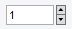

# NumericUpDownを実装する



- WPFは標準でNumericUpDownコントロールを提供しないため独自に実装した実装例を示す

## Xaml
```
<UserControl x:Class="Common.usercontrol.src.NumericUpDown"
             xmlns="http://schemas.microsoft.com/winfx/2006/xaml/presentation"
             xmlns:x="http://schemas.microsoft.com/winfx/2006/xaml"
			 IsEnabledChanged="UserControl_IsEnabledChanged"
			 PreviewMouseWheel="UserControl_PreviewMouseWheel"
			 MouseEnter="UserControl_MouseEnter" MouseLeave="UserControl_MouseLeave"
			 GotKeyboardFocus="UserControl_GotKeyboardFocus" LostKeyboardFocus="UserControl_LostKeyboardFocus">

	<Grid>
		<Grid.ColumnDefinitions>
			<ColumnDefinition Width="*"/>
			<ColumnDefinition Width="Auto"/>
			<ColumnDefinition Width="Auto"/>
		</Grid.ColumnDefinitions>

		<TextBox Grid.Column="0" Name="EditBox" TextChanged="EditBox_TextChanged" VerticalContentAlignment="Center"
				 PreviewKeyDown="EditBox_PreviewKeyDown" PreviewKeyUp="EditBox_PreviewKeyUp" InputMethod.IsInputMethodEnabled="False"/>

		<Label Grid.Column="1" Name="HorizontalSeparator" Width="2"/>
		
		<Grid Grid.Column="2">
			<Grid.RowDefinitions>
				<RowDefinition Height="*"/>
				<RowDefinition Height="*"/>
			</Grid.RowDefinitions>

			<RepeatButton Grid.Row="0" Name="BtnUp" FontFamily="Marlett" Content="t" FontSize="8" BorderThickness="1,1,1,1" Padding="0,-1,0,-1"
						  VerticalContentAlignment="Center" HorizontalContentAlignment="Center" Focusable="False"
						  VerticalAlignment="Stretch" HorizontalAlignment="Stretch"
						  IsTabStop="False" Click="BtnUp_Click" PreviewMouseLeftButtonUp="Btn_PreviewMouseLeftButtonUp"/>

			<RepeatButton Grid.Row="2" Name="BtnDown" FontFamily="Marlett" Content="u" FontSize="8" BorderThickness="1,0,1,1" Padding="0,-1,0,-1"
						  VerticalContentAlignment="Center" HorizontalContentAlignment="Center" Focusable="False"
						  VerticalAlignment="Stretch" HorizontalAlignment="Stretch"
						  IsTabStop="False" Click="BtnDown_Click" PreviewMouseLeftButtonUp="Btn_PreviewMouseLeftButtonUp"/>
		</Grid>

	</Grid>
</UserControl>
```

## Xaml.cs
```
using System;
using System.Collections.ObjectModel;
using System.Linq;
using System.Windows;
using System.Windows.Controls;
using System.Windows.Data;
using System.Windows.Input;

namespace Common.usercontrol.src
{
    public partial class NumericUpDown : UserControl
    {
        public NumericUpDown()
        {
            this.InitializeComponent();
        }

        public static readonly DependencyProperty ItemsSourceProperty = DependencyProperty.Register(
            "ItemsSource",
            typeof( ObservableCollection<string> ),
            typeof( NumericUpDown )
        );

        public ObservableCollection<string> ItemsSource
        {
            get
            {
                return (ObservableCollection<string>)GetValue( NumericUpDown.ItemsSourceProperty );
            }
            set
            {
                SetValue( NumericUpDown.ItemsSourceProperty, value );
            }
        }

        public static readonly DependencyProperty TextProperty = DependencyProperty.Register(
            "Text",
            typeof( string ),
            typeof( NumericUpDown ),
            new FrameworkPropertyMetadata( "Text", FrameworkPropertyMetadataOptions.BindsTwoWayByDefault, new PropertyChangedCallback( NumericUpDown.OnTextChanged ) )
        );

        public string Text
        {
            get
            {
                return (string)GetValue( NumericUpDown.TextProperty );
            }
            set
            {
                SetValue( NumericUpDown.TextProperty, value );
            }
        }

        private static void OnTextChanged( DependencyObject obj, DependencyPropertyChangedEventArgs e )
        {
            NumericUpDown spinBox = obj as NumericUpDown;
            if( spinBox != null )
            {
                spinBox.EditBox.Text = spinBox.Text;
            }
        }

        public static readonly DependencyProperty LoopProperty = DependencyProperty.Register(
            "Loop",
            typeof( bool ),
            typeof( NumericUpDown ),
            new FrameworkPropertyMetadata( true, FrameworkPropertyMetadataOptions.BindsTwoWayByDefault )
        );

        public bool Loop
        {
            get
            {
                return (bool)GetValue( NumericUpDown.LoopProperty );
            }
            set
            {
                SetValue( NumericUpDown.LoopProperty, value );
            }
        }

        public static readonly DependencyProperty MaxLengthProperty = DependencyProperty.Register(
            "MaxLength",
            typeof( int ),
            typeof( NumericUpDown ),
            new FrameworkPropertyMetadata( 100, FrameworkPropertyMetadataOptions.BindsTwoWayByDefault, new PropertyChangedCallback( NumericUpDown.OnMaxLengthChanged ) )
        );

        public int MaxLength
        {
            get
            {
                return (int)GetValue( NumericUpDown.MaxLengthProperty );
            }
            set
            {
                SetValue( NumericUpDown.MaxLengthProperty, value );
            }
        }

        private static void OnMaxLengthChanged( DependencyObject obj, DependencyPropertyChangedEventArgs e )
        {
            NumericUpDown spinBox = obj as NumericUpDown;
            if( spinBox != null )
            {
                spinBox.EditBox.MaxLength = (int)e.NewValue;
            }
        }

        public static readonly RoutedEvent TextChangedEvent = EventManager.RegisterRoutedEvent(
            "TextChanged",
            RoutingStrategy.Direct,
            typeof( TextChangedEventHandler ),
            typeof( NumericUpDown )
        );

        public event TextChangedEventHandler TextChanged
        {
            add
            {
                this.AddHandler( TextChangedEvent, value );
            }
            remove
            {
                this.RemoveHandler( TextChangedEvent, value );
            }
        }

        public TextBox TextBox
        {
            get
            {
                return this.EditBox;
            }
        }

        private void UserControl_IsEnabledChanged( object sender, DependencyPropertyChangedEventArgs e )
        {
            this.EditBox.IsReadOnly = !this.IsEnabled;
            this.BtnUp.IsEnabled = this.IsEnabled;
            this.BtnDown.IsEnabled = this.IsEnabled;
        }

        private void EditBox_TextChanged( object sender, TextChangedEventArgs e )
        {
            this.Text = this.EditBox.Text;
            this.RaiseEvent( new TextChangedEventArgs( NumericUpDown.TextChangedEvent, e.UndoAction, e.Changes ) );
        }

        private void EditBox_PreviewKeyDown( object sender, KeyEventArgs e )
        {
            e.Handled = true;
            if( Key.Up == e.Key || Key.Down == e.Key )
            {
                if( Key.Up == e.Key )
                {
                    this.MoveUp();
                }
                else if( Key.Down == e.Key )
                {
                    this.MoveDown();
                }
            }
            else
            {
                e.Handled = false;
            }
        }

        private void EditBox_PreviewKeyUp( object sender, KeyEventArgs e )
        {
            if( Key.Up == e.Key || Key.Down == e.Key || Key.Enter == e.Key )
            {
                e.Handled = true;
                this.UpdateBindingSource( this );
            }
        }

        private void BtnUp_Click( object sender, RoutedEventArgs e )
        {
            if( !this.TextBox.IsFocused )
            {
                this.TextBox.Focus();
            }
            this.MoveUp();
        }

        private void BtnDown_Click( object sender, RoutedEventArgs e )
        {
            if( !this.TextBox.IsFocused )
            {
                this.TextBox.Focus();
            }
            this.MoveDown();
        }

        private void Btn_PreviewMouseLeftButtonUp( object sender, MouseButtonEventArgs e )
        {
            this.UpdateBindingSource( this );
        }


        private bool _isMouseWheelEnabled = false;
        private int _mouseWheelDelta = 0;
        private object _lock = new object();

        private void UserControl_PreviewMouseWheel( object sender, MouseWheelEventArgs e )
        {
            if( !this._isMouseWheelEnabled )
            {
                return;
            }

            if( sender == this )
            {
                e.Handled = true;
            }

            lock( this._lock )
            {
                this._mouseWheelDelta = e.Delta;
            }

            if( 0 < e.Delta )
            {
                this.MoveUp();
            }
            else if( 0 > e.Delta )
            {
                this.MoveDown();
            }
        }

        private void UpdateBindingSourceByMouseWheel( object sender, MouseEventArgs e )
        {
            lock( this._lock )
            {
                if( this._mouseWheelDelta != 0 )
                {
                    this._mouseWheelDelta = 0;
                    this.UpdateBindingSource( this );
                }
            }
        }

        private void UserControl_MouseEnter( object sender, MouseEventArgs e )
        {
            this.MouseMove += this.UpdateBindingSourceByMouseWheel;
        }

        private void UserControl_MouseLeave( object sender, MouseEventArgs e )
        {
            this.MouseMove -= this.UpdateBindingSourceByMouseWheel;
        }

        private void UserControl_GotKeyboardFocus( object sender, KeyboardFocusChangedEventArgs e )
        {
            this._isMouseWheelEnabled = true;
        }

        private void UserControl_LostKeyboardFocus( object sender, KeyboardFocusChangedEventArgs e )
        {
            this._isMouseWheelEnabled = false;
        }

        private void MoveUp()
        {
            if( this.ItemsSource == null )
            {
                throw new NullReferenceException( "NumericUpDown is not initialized" );
            }
            if( 0 == this.ItemsSource.Count )
            {
                return;
            }

            int currentIndex = this.ItemsSource.IndexOf( this.Text );
            if( currentIndex < 0 )
            {
                if( this.Loop )
                {
                    this.Text = this.ItemsSource.First();
                }
            }
            else if( currentIndex < this.ItemsSource.Count - 1 )
            {
                this.Text = this.ItemsSource[currentIndex + 1];
            }
            else
            {
                if( this.Loop )
                {
                    this.Text = this.ItemsSource.First();
                }
            }

            this.EditBox.SelectAll();
        }

        private void MoveDown()
        {
            if( this.ItemsSource == null )
            {
                throw new NullReferenceException( "NumericUpDown is not initialized" );
            }
            if( 0 == this.ItemsSource.Count )
            {
                return;
            }

            int currentIndex = this.ItemsSource.IndexOf( this.Text );
            if( currentIndex < 0 )
            {
                if( this.Loop )
                {
                    if( double.TryParse( this.ItemsSource.First(), out double _ ) )
                    {
                        this.Text = this.ItemsSource.Last();
                    }
                    else
                    {
                        this.Text = this.ItemsSource.First();
                    }
                }
            }
            else if( currentIndex == 0 )
            {
                if( this.Loop )
                {
                    this.Text = this.ItemsSource.Last();
                }
            }
            else
            {
                this.Text = this.ItemsSource[currentIndex - 1];
            }

            this.EditBox.SelectAll();
        }

        private void UpdateBindingSource( NumericUpDown spinBox )
        {
            BindingExpression bind = this.GetBindingExpression( NumericUpDown.TextProperty );
            if( bind != null )
            {
                bind.UpdateSource();
            }
        }

    }
}
```

## 使用例

- Xaml
```
    <NumericUpDown ItemsSource="{Binding NumericUpDown1}" Text="{Binding SelectedValue}">
```

- ViewModel
```
    public ObservableCollection<string> NumericUpDown1 { get; set; } = new ObservableCollection<string>() { "0", "1" };
    public string SelectedValue { get; set; } = "0";
```
- 保持する型がint型ではなくstring型であることに注意
（0と空欄を表現できるようにするため）