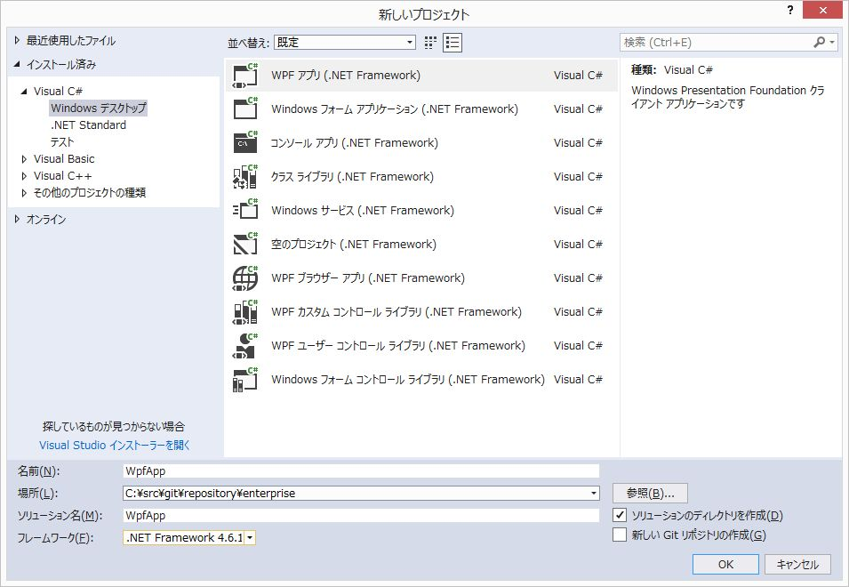
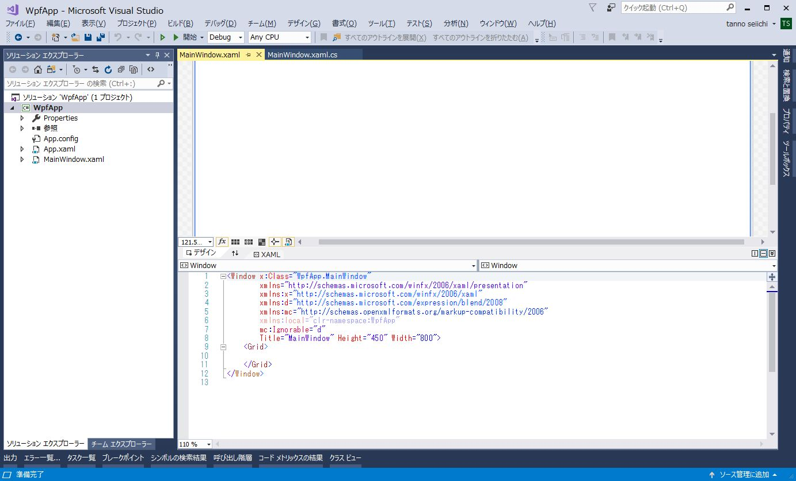

# 新規プロジェクトの作成

1. VisualStudo起動 
2. ファイルメニュー＞新規作成＞プロジェクトを選択 
3. WPFアプリ（.NetFramework）を選択 
4. フレームワークはこだわりがなければ4.6.x（Windows10プリインストール・バージョン）を選択 
5. 名前に作成するアプリ名を入力してOKボタン押下 

新規生成されたプロジェクトのソースコードが表示される（VisualStudioのバージョンや設定によって初期表示される内容は異なります）

