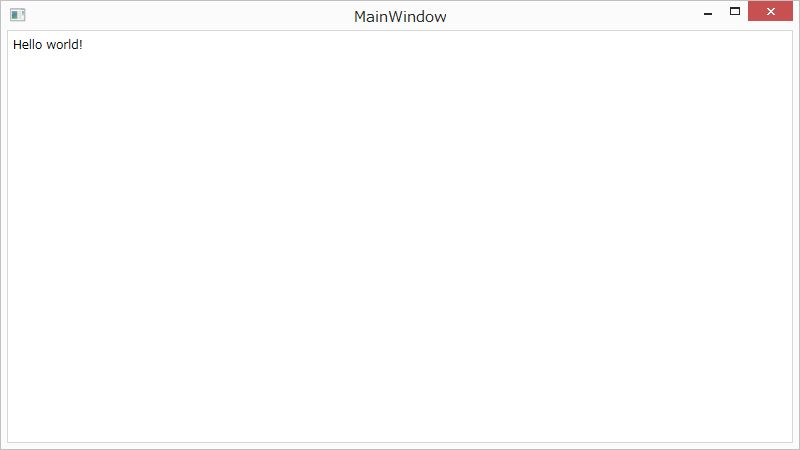

[WPF開発ノウハウ集](../index.md)
# 文字の表示

1. [新規プロジェクトの作成](./1.Project.md) で作ったプロジェクトのMainWindow.xamlの `<Grid>`〜`</Grid>` の間に `<Label Content="Hello world!"/>` を追加
2. デバッグ実行してウインドウに "Hello World!" と表示されれば成功

