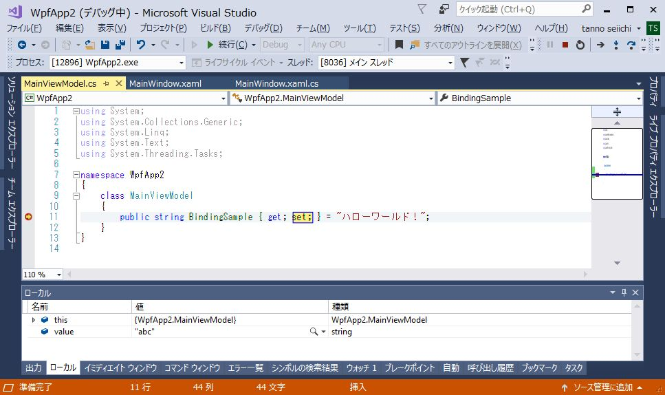

[WPF開発ノウハウ集](../index.md)
# Binding（入力）の実装

1. [Binding(表示)](./Binding_set.md) で MainWindow.xaml に追加した Label を TextBox に修正 `<Label Content="{Binding BindingSample}"/>` ↓ `<TextBox Text="{Binding BindingSample}"/>` 
2. MainViewModelに追加したプロパティの `set;` にカーソルをあててコンテキストメニュー＞ブレークポイント＞ブレークポイントの挿入を選択 （ `set;` が反転したらブレークポイントの設定は成功）
3. デバッグ実行してウインドウに表示された"ハローワールド！"をdeleteして"abc"と入力してウインドウを `Xボタン` で閉じる※ （※デフォルトではロストフォーカス時にBinding更新するが、今回はウインドウ上にフォーカスの移動先がないのでウインドウを閉じてロストフォーカスを発生させる）
4. 2.で設定したブレークポイントでブレークがかかり、ローカルウインドウのvalue欄に"abc"が表示されれば成功 

- ローカルウインドウが見つからない場合はデバッグメニュー＞ウインドウ＞ローカルを選択して表示
