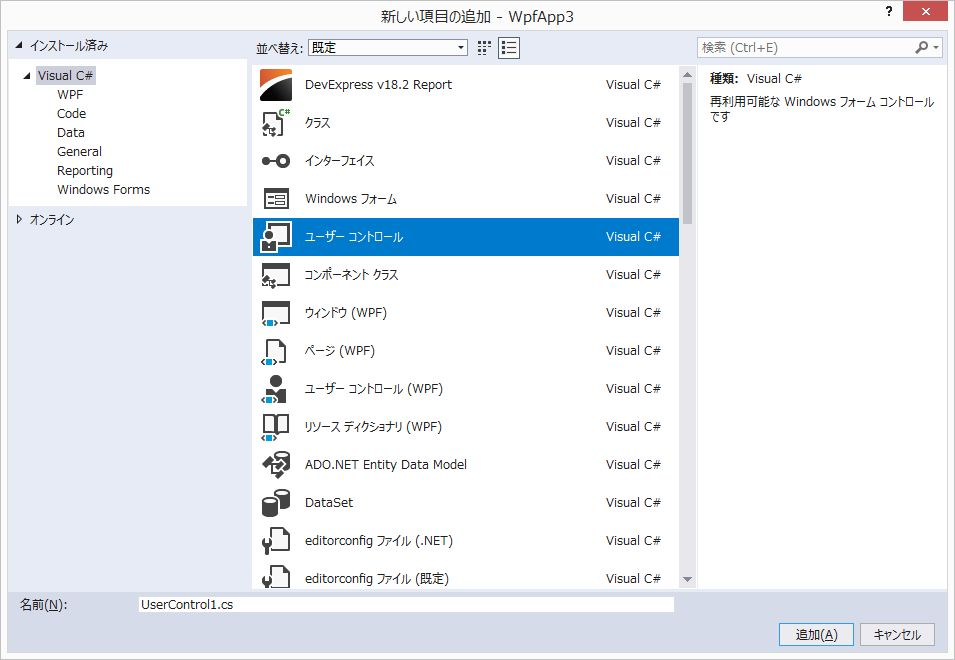
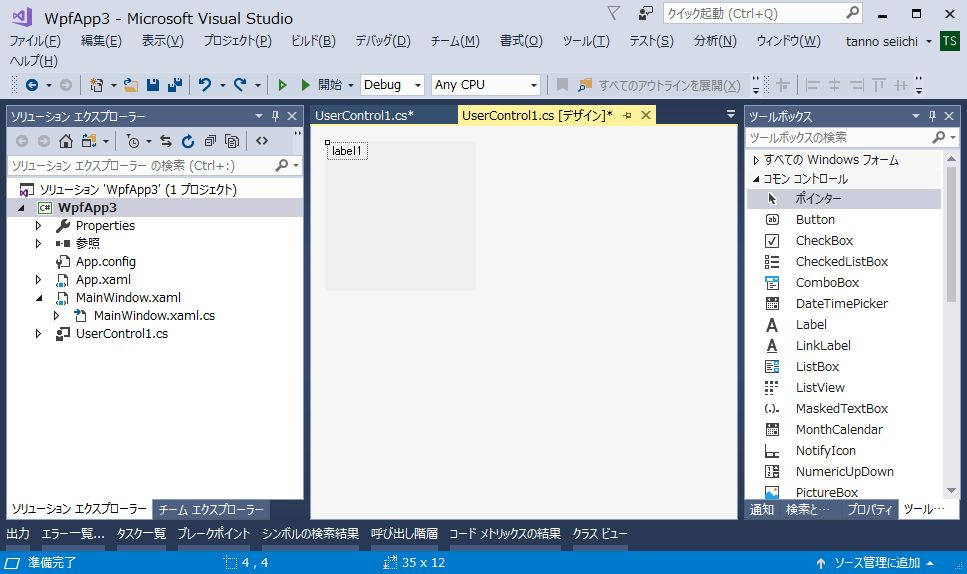
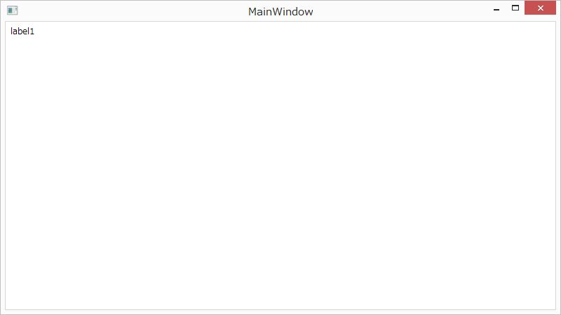

[WPF開発ノウハウ集](../index.md)
# WPFの画面にWinFormsのコントロールを組込んで表示する

#### メリット／デメリット
- DataGridView等、多機能かつ高速なWinForms用のControlを利用できる (メリット）
- WPFに組込んだWinFormsのControlは画面動作がスムーズでない傾向がある（デメリット）

<br/>

1. アセンブリ参照に `System.Windows.Forms` を追加
2. ソリューションエクスプローラーのContextMenu＞追加＞新しい項目を選択
3. ユーザーコントロール（WPFでない方）を追加


4. WinFormsのエディター画面が開くので、適当に編集


5. Xaml.cs を編集
    ```
    using System.Windows;
    using System.Windows.Forms.Integration; /* WindowsFormsHost を使うための記述 */

    namespace WpfApp3
    {
        public partial class MainWindow : Window
        {
            public MainWindow()
            {
                this.InitializeComponent();

                /* WinFormsで作ったUserControlを画面に追加 */
                this.Content = new WindowsFormsHost { Child = new UserControl1() };
            }
        }
    }
    ```

6. デバッグ実行してWinFormsで作ったUserControlが表示されれば成功


<br/>

参考： UserContorlの代わりにSystem.Windows.Forms.Labelを直接組込む場合
```
    using System.Windows;
    using System.Windows.Forms.Integration; /* WindowsFormsHost を使うための記述 */

    namespace WpfApp3
    {
        public partial class MainWindow : Window
        {
            public MainWindow()
            {
                this.InitializeComponent();

                this.Content = new WindowsFormsHost { Child = new System.Windows.Forms.Label() { Text = "Label2" } };
            }
        }
    }
```