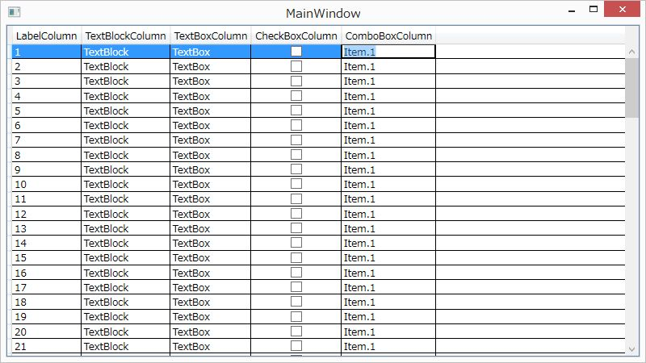
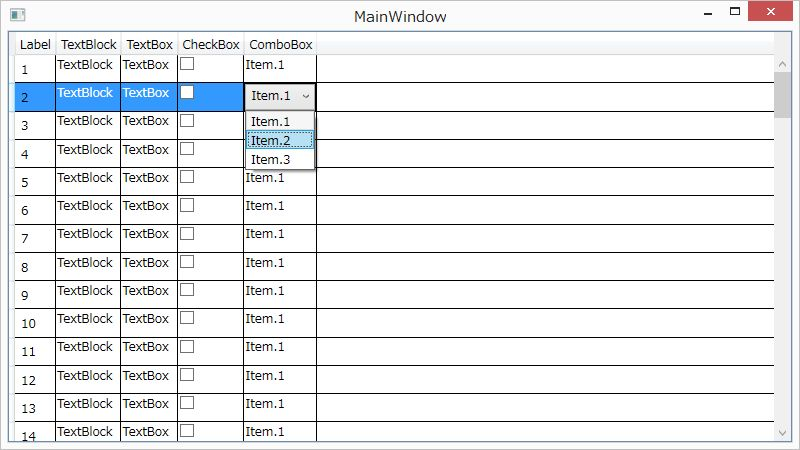

[WPF開発ノウハウ集](../index.md)
# Xaml(DataGrid)の実装

#### 基本

```
<DataGrid ItemsSource="{Binding DataGrid1}">
```
- 列ヘッダには Bind したクラスのプロパティ名が表示される
- 各セルは TextBox、プロパティが bool型の場合は CheckBox で表示される


#### 列毎に表示するコントロールを制御する

- 列ヘッダに表示する文字を指定する
- 各セルに表示するコントロールを指定する
```
<Window.Resources>
    <CollectionViewSource x:Key="ComboBox1" Source="{Binding ComboBox1}"/>
</Window.Resources>

<DataGrid ItemsSource="{Binding DataGrid1}" 
        　AutoGenerateColumns="False" CanUserAddRows="False">

    <DataGrid.Columns>

        <DataGridTemplateColumn Header="Label">
            <DataGridTemplateColumn.CellTemplate>
                <DataTemplate>
                    <Label Content="{Binding LabelColumn}"/>
                </DataTemplate>
            </DataGridTemplateColumn.CellTemplate>
        </DataGridTemplateColumn>
        
        <DataGridTemplateColumn Header="TextBlock">
            <DataGridTemplateColumn.CellTemplate>
                <DataTemplate>
                    <TextBlock Text="{Binding TextBlockColumn}"/>
                </DataTemplate>
            </DataGridTemplateColumn.CellTemplate>
        </DataGridTemplateColumn>

        <DataGridTemplateColumn Header="TextBox">
            <DataGridTemplateColumn.CellTemplate>
                <DataTemplate>
                    <TextBox Text="{Binding TextBoxColumn}"/>
                </DataTemplate>
            </DataGridTemplateColumn.CellTemplate>
        </DataGridTemplateColumn>

        <DataGridTemplateColumn Header="CheckBox">
            <DataGridTemplateColumn.CellTemplate>
                <DataTemplate>
                    <CheckBox IsChecked="{Binding CheckBoxColumn}"/>
                </DataTemplate>
            </DataGridTemplateColumn.CellTemplate>
        </DataGridTemplateColumn>

        <DataGridTemplateColumn Header="ComboBox">
            <DataGridTemplateColumn.CellTemplate>
                <DataTemplate>
                    <ComboBox ItemsSource="{Binding Source={StaticResource ComboBox1}}"
                            　SelectedItem="{Binding ComboBoxColumn}"/>
                </DataTemplate>
            </DataGridTemplateColumn.CellTemplate>
        </DataGridTemplateColumn>

    </DataGrid.Columns>

</DataGrid>
```

#### 表示するコントロールを、表示時と編集時で切替える
選択中のセル以外は軽量なコントロール(TextBlock等)を表示して、重いコントロール(ComboBox等)はセルを選択した時に読み込むことで、DataGrid全体の読込速度を改善する

##### Triggerを使った実装例
- Xaml
    ```
    <DataGridTemplateColumn Header="TextBox">
        <DataGridTemplateColumn.CellStyle>
            <Style TargetType="{x:Type DataGridCell}" BasedOn="{StaticResource {x:Type DataGridCell}}">
                <Style.Triggers>
                    <MultiTrigger>
                        <MultiTrigger.Conditions>
                            <Condition Property="IsKeyboardFocusWithin" Value="True"/>
                        </MultiTrigger.Conditions>
                        <Setter Property="IsEditing" Value="True"/>
                    </MultiTrigger>
                </Style.Triggers>
            </Style>
        </DataGridTemplateColumn.CellStyle>
        <DataGridTemplateColumn.CellTemplate>
            <DataTemplate>
                <TextBlock Text="{Binding ComboBoxColumn}"/>
            </DataTemplate>
        </DataGridTemplateColumn.CellTemplate>
        <DataGridTemplateColumn.CellEditingTemplate>
            <DataTemplate>
                <ComboBox ItemsSource="{Binding Source={StaticResource ComboBox1}}"
                        　SelectedItem="{Binding ComboBoxColumn}"
                          Loaded="ComboBox_Loaded"/>
            </DataTemplate>
        </DataGridTemplateColumn.CellEditingTemplate>
    </DataGridTemplateColumn>
    ```
- Xaml.cs
    ```
    private void ComboBox_Loaded( object sender, RoutedEventArgs e )
    {
        if( sender is ComboBox cb )
        {
            Keyboard.Focus( cb );
        }
    }
    ```

##### Eventを使った実装例
- Xaml
    ```
    <DataGridTemplateColumn Header="ComboBox">
        <DataGridTemplateColumn.CellStyle>
            <Style TargetType="{x:Type DataGridCell}" BasedOn="{StaticResource {x:Type DataGridCell}}">
                <EventSetter Event="PreviewMouseLeftButtonUp" Handler="DataGridCell_PreviewMouseLeftButtonUp"/>
            </Style>
        </DataGridTemplateColumn.CellStyle>
        <DataGridTemplateColumn.CellTemplate>
            <DataTemplate>
                <TextBlock Text="{Binding ComboBoxColumn}"/>
            </DataTemplate>
        </DataGridTemplateColumn.CellTemplate>
        <DataGridTemplateColumn.CellEditingTemplate>
            <DataTemplate>
                <ComboBox ItemsSource="{Binding Source={StaticResource ComboBox1}}"
                        　SelectedItem="{Binding ComboBoxColumn}"
                          Loaded="ComboBox_Loaded"/>
            </DataTemplate>
        </DataGridTemplateColumn.CellEditingTemplate>
    </DataGridTemplateColumn>
    ```   
- Xaml.cs
    ```
    private void DataGridCell_PreviewMouseLeftButtonUp( object sender, MouseButtonEventArgs e )
    {
        if( sender is DataGridCell cell )
        {
            cell.IsEditing = true;
        }
    }

    private void ComboBox_Loaded( object sender, RoutedEventArgs e )
    {
        if( sender is ComboBox cb )
        {
            Keyboard.Focus( cb );
        }
    }
    ```

（Bindingについては [Binding(DataGrid)の実装](../Binding/DataGrid.md) の項を参照）